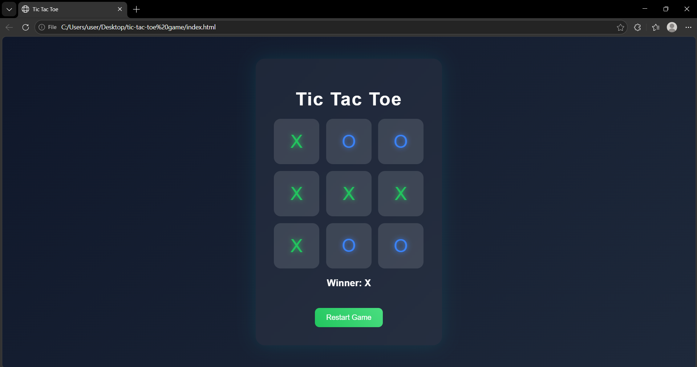

# 🎮 Tic Tac Toe Web Application

A modern and interactive **Tic Tac Toe Game** built using **HTML, CSS, and JavaScript** with a premium glass UI and basic AI opponent.

---

## 🚀 Live Demo

🔗 https://pawanpushkar.github.io/tic-tac-toe-game/

---

## 📸 Preview



---

## ✨ Features

* 🎯 Player vs Computer gameplay
* 🧠 Basic AI (random move logic)
* 🎨 Premium Glassmorphism UI
* ✨ Smooth animations & hover effects
* 🟢 Restart game functionality
* ⚡ Fast and responsive design

---

## 🛠️ Tech Stack

* HTML5
* CSS3
* JavaScript (Vanilla JS)

---

## 📂 Project Structure

```
tic-tac-toe-game/
│
├── index.html
├── style.css
├── script.js
├── output.png
└── README.md
```

---

## ⚙️ How to Run Locally

1. Clone the repository

```
git clone https://github.com/pawanpushkar/tic-tac-toe-game.git
```

2. Open the folder

```
cd tic-tac-toe-game
```

3. Run the project

* Open `index.html` in your browser
  OR
* Use Live Server (VS Code recommended)

---

## 🌐 Deploy on GitHub Pages

1. Push your code to GitHub
2. Go to **Settings → Pages**
3. Select branch: `main`
4. Save

Your project will be live at:
👉 https://pawanpushkar.github.io/tic-tac-toe-game/

---

## 🧠 Game Logic

* Tracks moves using an array
* Checks winning patterns
* Prevents invalid moves
* Includes simple AI using random selection

---

## 📌 Internship Task

This project is created as part of a **Web Development Internship Task** to demonstrate:

* DOM manipulation
* Event handling
* Game logic implementation
* UI/UX design skills

---

## 🤝 Contributing

Feel free to fork this repo and improve the game 🚀

---

## 📄 License

This project is open-source and free to use.

## Author
**Pawan Pushkar**
